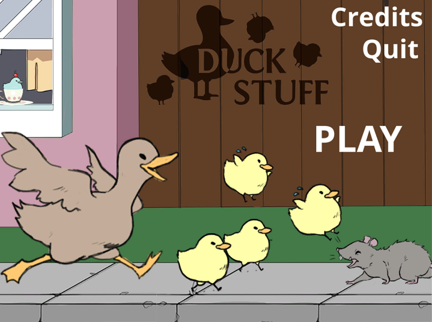
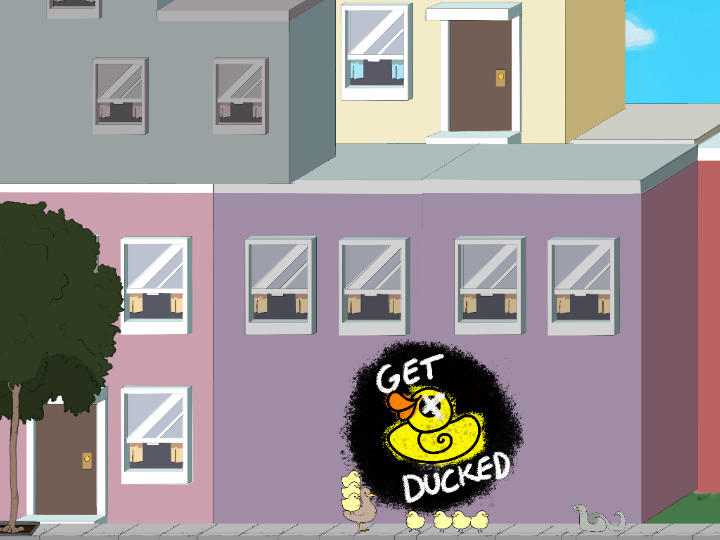
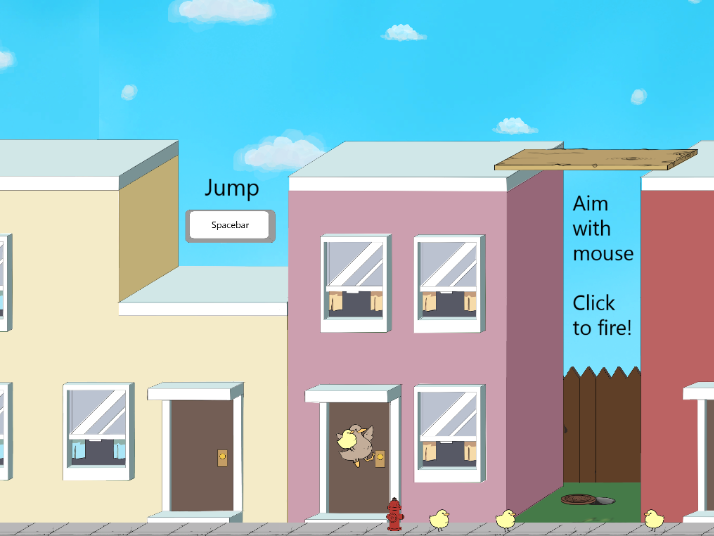
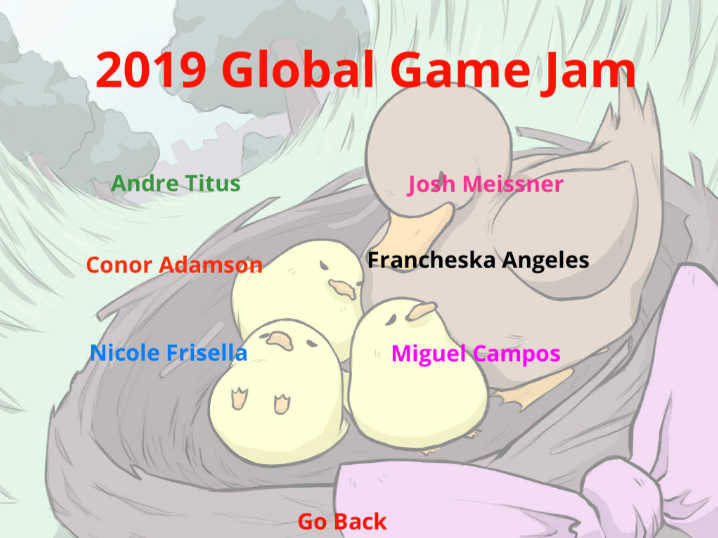
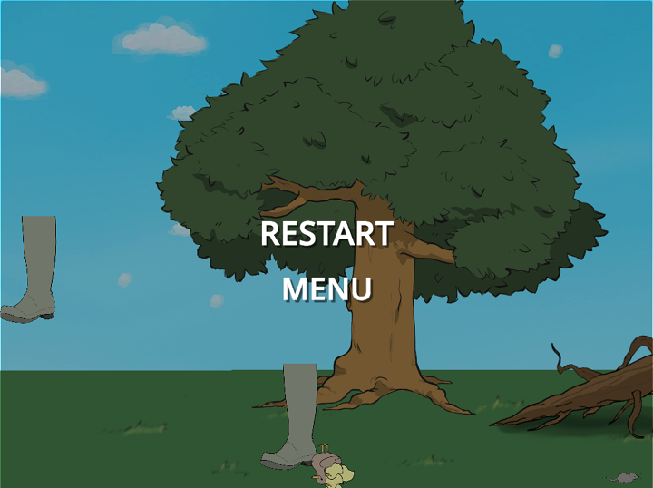

# DuckStuff

[GGJ19 Submission](https://globalgamejam.org/2019/games/duck-stuff): A game about protecting your ducklings!

## Gameplay:

The goal of the game is to safely traverse the map with as many ducklings as possible. Your ducklings are also projectiles so fling them at your enemies to clear the path! There are different ending screens available.

## Controls:

| Button | Action  |
|:-:|:-:|
| A | Move left.  |
| D | Move right. |
| Space | Jump. |
| Mouse | Aim your duckling. |
| Left-Click  | Throw your duckling. |
- Collide with ducklings to pick them up!
- You can only carry 3 ducklings at any given time.

## Credits:

Francheska Angeles, Nicole Frisella, Miguel Campos, Josh Meissner, Andre Titus, and Conor Adamson

###### Soundtrack was removed to save space.

